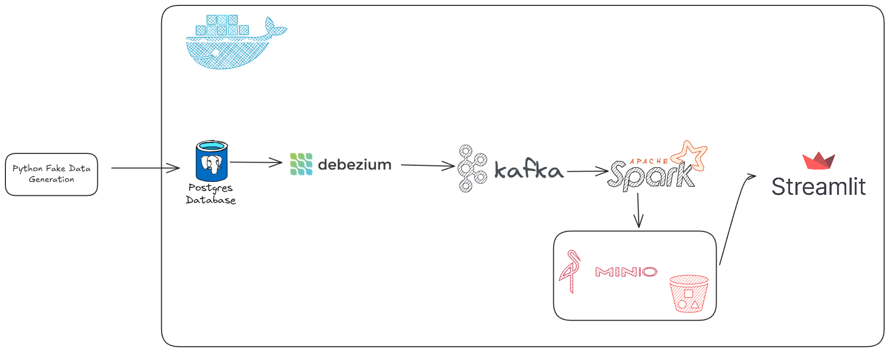

# Realtime E-Commerce Data Pipeline

An end-to-end **real-time streaming data pipeline** that captures Change Data Capture (CDC) events from a transactional e-commerce database, streams them through Kafka, lands raw data into an S3-compatible data lake via Spark Structured Streaming, and visualises key metrics on a live dashboard.



## Tech Stack

| Layer | Technology |
|---|---|
| **Source Database** |  with logical replication |
| **Change Data Capture** |  (Kafka Connect) |
| **Message Broker** |  (Confluent 7.7) |
| **Stream Processing** |  Structured Streaming |
| **Data Lake** |  (S3-compatible, Parquet format) |
| **Dashboard** |  |
| **Orchestration** |  |
| **Language** |  |

## Architecture

```
┌────────────┐      CDC       ┌───────────┐            ┌──────────────┐
│ PostgreSQL │ ──────────────▶ │  Debezium │ ─────────▶ │    Kafka     │
│  (source)  │  wal_level=    │ (Connect) │            │   (KRaft)    │
└────────────┘  logical       └───────────┘            └──────┬───────┘
      ▲                                                       │
      │  Live orders                    CDC topics ───────────┤
      │  & web events                   + web_events topic    │
      │                                                       ▼
┌─────┴──────┐                                      ┌─────────────────┐
│  Pipeline  │                                      │ Spark Structured│
│  Service   │                                      │   Streaming     │
│ (seeder +  │                                      └────────┬────────┘
│  producer) │                                               │
└────────────┘                                               ▼
                                                    ┌─────────────────┐
                                                    │   MinIO (S3)    │
                                                    │  raw/ Parquet   │
                                                    └────────┬────────┘
                                                             │
                                                             ▼
                                                    ┌─────────────────┐
                                                    │   Streamlit     │
                                                    │   Dashboard     │
                                                    └─────────────────┘
```

## Project Structure

```
├── docker-compose.yml              # Service orchestration
├── Dockerfile.pipeline             # Data seeder & Kafka producer
├── Dockerfile.spark                # Spark Structured Streaming consumer
├── Dockerfile.dashboard            # Streamlit dashboard
├── Makefile                        # Shortcuts (make up, make down, …)
├── requirements.txt                # Dashboard dependencies
├── requirements.pipeline.txt       # Pipeline core dependencies
│
└── pipeline_app/
    ├── main.py                     # Pipeline entrypoint — seed, register Debezium, produce events
    ├── config.py                   # Centralised settings from environment variables
    ├── database.py                 # PostgreSQL helpers (DDL, inserts, health check)
    ├── generator.py                # Faker-based synthetic data generators
    ├── kafka_producer.py           # Web-events Kafka producer (runs in thread)
    ├── debezium.py                 # Debezium connector registration & health check
    ├── storage.py                  # MinIO / S3 client builder & bucket bootstrap
    ├── dashboard.py                # Streamlit dashboard app
    │
    └── spark_pipeline/             # Spark Structured Streaming package
        ├── app.py                  # Orchestration — bootstrap, build streams, await termination
        ├── definitions.py          # CDC schemas, RawDatasetSpec dataclass, constants
        ├── transforms.py           # Projection builders & enrichment functions
        └── specs.py                # Dataset specification list (8 CDC tables + web events)
```

## Data Sources

The pipeline generates and captures **8 CDC tables** plus a direct Kafka topic:

| Dataset | Source | Description |
|---|---|---|
| `customers` | CDC | Customer profiles (200 initial) |
| `products` | CDC | Product catalog (100 initial) |
| `orders` | CDC | Purchase orders (2 000 initial + live) |
| `order_items` | CDC | Line items per order |
| `payments` | CDC | Payment transactions (2 500 initial + live) |
| `support_tickets` | CDC | Customer support tickets (300 initial) |
| `incidents` | CDC | Operational incidents (30 initial) |
| `marketing_spend` | CDC | Channel marketing spend (100 initial) |
| `web_events` | Kafka (direct) | Clickstream events (page_view, add_to_cart, purchase, …) |

## Getting Started

### Prerequisites

- **Docker** & **Docker Compose** v2+
- Ports available: `5432`, `9092`, `29092`, `8083`, `9000`, `9001`, `4040`, `8501`

### 1. Clone the repository

```bash
git clone https://github.com/<your-username>/ecommerce-data-pipeline.git
cd ecommerce-data-pipeline
```

### 2. Configure environment

Create a `.env` file in the project root:

```env
# PostgreSQL
POSTGRES_DB=ecommerce
POSTGRES_USER=postgres
POSTGRES_PASSWORD=postgres
DB_HOST=postgres
DB_PORT=5432

# Kafka
KAFKA_BOOTSTRAP_SERVERS=kafka:9092
KAFKA_WEB_EVENTS_TOPIC=web_events

# Debezium
DEBEZIUM_URL=http://debezium:8083
DEBEZIUM_CONNECTOR_NAME=ecommerce-connector
DEBEZIUM_TOPIC_PREFIX=dbserver1

# MinIO
MINIO_ENDPOINT=http://minio:9000
MINIO_ACCESS_KEY=minioadmin
MINIO_SECRET_KEY=minioadmin
MINIO_BUCKET=lake
```

### 3. Build & run

```bash
# Build all images and start in detached mode
make up-d-build

# Or without Make
docker compose up --build -d
```

### 4. Verify services

```bash
make ps
# Expected: postgres, kafka, debezium, minio, pipeline, spark-consumer, dashboard — all Up
```

### 5. Access UIs

| Service | URL |
|---|---|
| **Streamlit Dashboard** | [http://localhost:8501](http://localhost:8501) |
| **Spark UI** | [http://localhost:4040](http://localhost:4040) |
| **MinIO Console** | [http://localhost:9001](http://localhost:9001) |
| **Debezium REST API** | [http://localhost:8083/connectors](http://localhost:8083/connectors) |

## How It Works

1. **Pipeline service** starts → seeds PostgreSQL with synthetic data using Faker → registers the Debezium CDC connector → starts producing live orders and web clickstream events.
2. **Debezium** captures every INSERT/UPDATE/DELETE from PostgreSQL's WAL and publishes JSON events to per-table Kafka topics.
3. **Spark Structured Streaming** subscribes to all CDC topics + the `web_events` topic, parses and enriches each event, and writes partitioned Parquet files (`year/month/day/hour`) into MinIO's `raw/` prefix.
4. **Streamlit dashboard** reads the Parquet files directly from MinIO and renders KPIs, time-series charts, and data previews across Commerce, Traffic, and Operations tabs.

## Makefile Commands

| Command | Description |
|---|---|
| `make build` | Build all Docker images |
| `make up` | Start all services (attached) |
| `make up-d` | Start all services (detached) |
| `make up-build` | Build and start (attached) |
| `make up-d-build` | Build and start (detached) |
| `make down` | Stop and remove all containers |
| `make logs` | Follow logs from all services |
| `make ps` | Show running containers |
| `make restart` | Restart all services |
| `make rebuild` | Build with no cache |

## License

This project is for educational and portfolio purposes.
